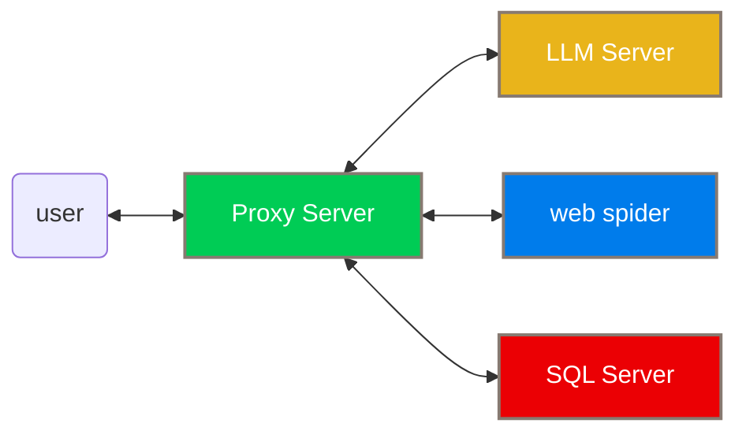
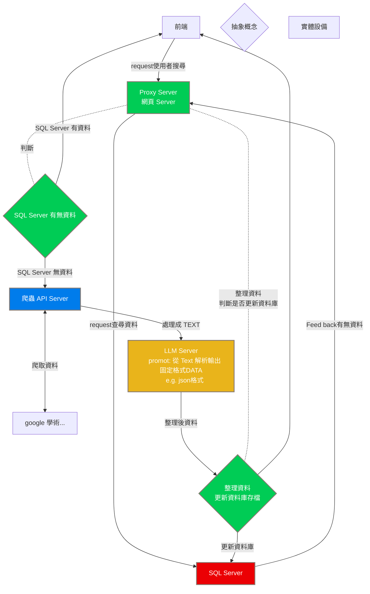

# PROMT DATA SERCHER
A spider to collect promtdata from scholar articles





# BUILD (Windows)
## install execution environment
> [GIT](https://git-scm.com/)

> [nodejs](https://nodejs.org/en)
## clone repositorie
```
git clone https://github.com/FUBUKINGFOX/promptdata.git
```
```
cd ./promptdata
```
## import module 
```
npm update
```
## setting config folder
### Rename following file
> API.example.ini ==> API.ini

> server_setting.example.ini ==> server_setting.ini

> spider.example.ini ==> spider.ini

## start the spider
```
node ./main.js
```

# License
> [MIT](./LICENSE)
